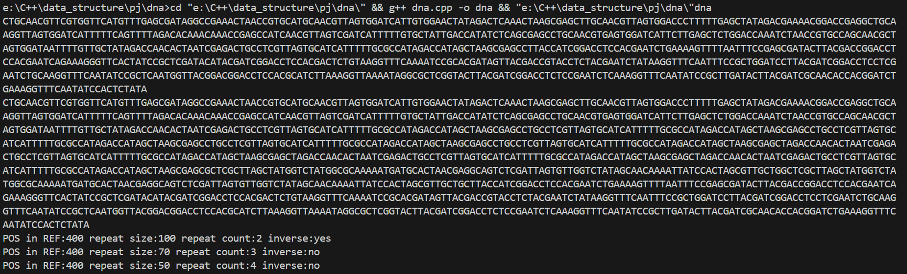

## 实验报告：DNA 序列划分与分析

### 1. 实验目的
实现一个 DNA 序列划分与分析算法，将给定的 `query` 字符串划分为最少的段，每段要么是 `reference` 的子串，要么是 `reference` 的互补翻转子串。同时，在段数最少的前提下，优先选择重复出现的区间，并分析被其他区间包含的小区间的相关信息。

### 2. 算法伪代码

#### 2.1 动态规划（DP）核心逻辑
以下是算法的关键部分，使用伪代码规范描述动态规划的实现：

```pseudocode
procedure COMPUTE_DP(query, substring_map):
    // 输入：query 为待划分字符串，substring_map 为预处理的子串哈希表
    // 输出：trace 记录划分路径
    n ← LENGTH(query)
    dp ← ARRAY[n + 1] INITIALIZED TO n + 1  // dp[i] 表示从 i 到末尾的最小段数
    dp[n] ← 0  // 空串划分段数为 0
    trace ← ARRAY[n]  // 记录转移信息
    interval_count ← MAP  // 统计区间出现次数

    FOR i ← n - 1 DOWNTO 0 DO:
        min_segments ← n + 1
        best_trace ← NULL
        FOR j ← i TO n - 1 DO:
            sub ← query[i..j]  // 提取子串
            IF sub IN substring_map THEN:
                next_pos ← j + 1
                segments ← 1 + dp[next_pos]  // 当前段数
                start, is_rc ← substring_map[sub]  // 获取子串起始位置和是否为互补翻转
                len ← next_pos - i
                interval_key ← (start, start + len - 1)  // 当前区间

                IF segments < min_segments THEN:
                    min_segments ← segments
                    best_trace ← (next_pos, start, is_rc)
                ELSE IF segments = min_segments THEN:
                    current_count ← interval_count[interval_key]
                    best_interval ← (best_trace[1], best_trace[1] + len - 1)
                    best_count ← interval_count[best_interval]
                    IF current_count > best_count THEN:
                        best_trace ← (next_pos, start, is_rc)  // 优先选择重复次数多的区间

        IF min_segments ≤ n THEN:
            dp[i] ← min_segments
            trace[i] ← best_trace
            interval_key ← (best_trace[1], best_trace[1] + (best_trace[0] - i) - 1)
            interval_count[interval_key] ← interval_count[interval_key] + 1

    RETURN trace
```

### 3. 原理分析

#### 3.1 预处理
- **目标**：构建一个哈希表 `substring_map`，存储 `reference` 及其互补翻转序列的所有子串，用于快速匹配。
- **方法**：
  1. 遍历 `reference`，生成所有可能的子串，记录其起始位置。
  2. 生成 `reference` 的互补翻转序列（`reference_rc`），同样提取所有子串，标记为互补翻转。
  3. 将子串及其信息（起始位置、是否为互补翻转）存入哈希表。

#### 3.2 动态规划
- **目标**：计算从 `query` 开头到末尾的最小划分段数。
- **状态定义**：
  - `dp[i]` 表示从位置 `i` 到 `query` 末尾的最小划分段数。
  - `dp[n] = 0`，表示空串无需划分。
- **转移方程**：
  - 对于每个位置 `i`，尝试所有可能的结束位置 `j`。
  - 如果子串 `query[i..j]` 在 `substring_map` 中，则 `dp[i] = min(dp[i], 1 + dp[j+1])`。
- **优化策略**：
  - 当多种划分方式的段数相同时，使用 `interval_count` 统计每个区间的出现次数，优先选择出现次数更多的区间。
- **路径记录**：
  - 使用 `trace` 数组记录每次转移的最佳选择（下一位置、起始位置、是否为互补翻转），便于后续重构划分结果。

#### 3.3 输出分析
- 通过 `trace` 重构划分的区间列表。
- 统计被其他区间严格包含的小区间，记录其结束位置、大小、重复次数及是否为互补翻转。

### 4. 时空复杂度分析

#### 4.1 时间复杂度
- **预处理**：
  - 生成 `reference` 及其互补翻转序列的所有子串：\(O(m^2)\)，其中 \(m\) 是 `reference` 的长度。
- **动态规划**：
  - 外层循环：\(O(n)\)，\(n\) 是 `query` 的长度。
  - 内层循环：对于每个 `i`，尝试所有 `j`，复杂度 \(O(n)\)。
  - 哈希表查询：\(O(1)\)。
  - 总计：\(O(n^2)\)。
- **总时间复杂度**：\(O(m^2 + n^2)\)。

#### 4.2 空间复杂度
- **哈希表**：存储所有子串，占用 \(O(m^2)\) 空间。
- **DP 数组**：`dp` 和 `trace` 数组，占用 \(O(n)\) 空间。
- **辅助结构**：`interval_count` 等，占用 \(O(n)\) 空间（区间数量通常远小于 \(n^2\)）。
- **总空间复杂度**：\(O(m^2 + n)\)。

### 5. 运行结果截图


### 6. 总结
本实验通过动态规划和哈希表实现了 DNA 序列的划分与分析，时间复杂度为 \(O(m^2 + n^2)\)，空间复杂度为 \(O(m^2 + n)\)。算法在保证最小段数的同时，优化了重复区间的选择，具有较高的实用性。未来可通过引入字符串匹配算法（如 KMP 或后缀数组）进一步降低时间复杂度。
